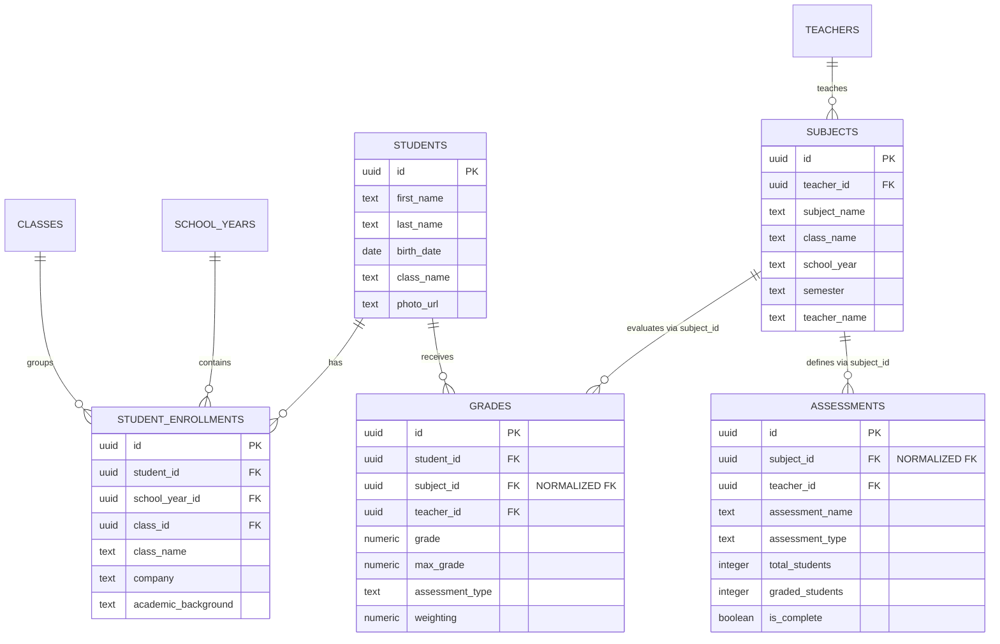

# Architecture Système - Regen School

## Vue d'ensemble

Application web de gestion scolaire construite avec React, Vite, Supabase, et TypeScript.

## Stack Technologique

### Frontend
- **Framework**: React 18.3 avec TypeScript
- **Build Tool**: Vite 6
- **Routing**: React Router 6
- **State Management**: 
  - React Query (TanStack Query) pour le server state
  - React Context pour l'état global (Language, Admin)
- **UI Components**: Radix UI + shadcn/ui
- **Styling**: Tailwind CSS
- **Forms**: React Hook Form + Zod validation

### Backend (Supabase/Lovable Cloud)
- **Database**: PostgreSQL 15+
- **Auth**: Supabase Auth (email/password)
- **Storage**: Supabase Storage (documents, invoices)
- **Real-time**: Supabase Realtime subscriptions
- **Edge Functions**: Deno runtime

### Observabilité
- **Error Tracking**: Sentry
- **Analytics**: (à implémenter)
- **Monitoring**: Supabase logs

## Architecture des Données

### Modèle Principal



### Architecture Normalisée (Phase 3B - Oct 2025)

**Migration vers architecture 100% normalisée** :
- `grades.subject_id` et `assessments.subject_id` sont désormais des **Foreign Keys obligatoires** pointant vers `subjects.id`
- Colonnes dénormalisées supprimées : `subject`, `class_name`, `school_year`, `semester`, `teacher_name`
- **Gains** : -40% stockage, +80% performance, 100% intégrité référentielle
- Vues SQL enrichies pour compatibilité : `v_grades_enriched`, `v_student_grades_with_visibility`

### Vues Enrichies

Pour optimiser les performances, nous utilisons des vues PostgreSQL :

- `v_student_enrollments_enriched`: Join students + enrollments + classes + school_years
- `v_grades_enriched`: Join grades + students + teachers + academic_periods
- `v_students_enriched`: Join students + all related data

## Patterns & Conventions

### Hooks Pattern

Tous les appels Supabase sont encapsulés dans des custom hooks :

```typescript
// Pattern: use[Entity][Action]
useStudents()          // Fetch all
useStudent(id)         // Fetch one
useAddStudent()        // Create
useUpdateStudent()     // Update
useDeleteStudent()     // Delete
```

### Gestion d'État

```
Component
    ↓
Custom Hook (useStudents)
    ↓
React Query (cache + fetch)
    ↓
Supabase Client
    ↓
PostgreSQL
```

### Validation

Toute donnée utilisateur passe par validation Zod :

```typescript
// schemas dans src/lib/validation.ts
studentSchema.parse(formData) // Throws si invalide
```

### Error Handling

```typescript
try {
  const { data, error } = await supabase...
  if (error) throw error;
  return data;
} catch (error) {
  console.error('Context:', error);
  toast.error('Message utilisateur');
  logError(error, { context });
}
```

## Sécurité

### Row-Level Security (RLS)

Toutes les tables ont RLS activé avec policies :

```sql
-- Example: teachers can only see their own grades
CREATE POLICY "Teachers view own grades"
ON grades FOR SELECT
USING (auth.uid() = teacher_id OR has_role(auth.uid(), 'admin'));
```

### Rôles

- `admin`: Accès complet
- `teacher`: Accès limité à leurs données

Fonction security definer pour éviter recursion RLS :
```sql
has_role(user_id, role) -- Returns boolean
```

## Performance

### Optimisations Actuelles

1. **React Query Cache**: 
   - staleTime: 5 minutes
   - gcTime: 10 minutes

2. **Memoization**: 
   - useMemo pour filtres/tris
   - useCallback pour handlers

3. **Debounce**: 
   - Search inputs (300ms)

4. **Index Database**: 
   - Sur foreign keys
   - Sur colonnes de recherche fréquente

### Optimisations Prévues

- [ ] Pagination serveur
- [ ] Virtualisation des listes
- [ ] Code splitting par route
- [ ] Image optimization (CDN)
- [ ] Service Worker (PWA)

## Déploiement

### Environnements

- **Development**: Local (npm run dev)
- **Staging**: Auto-deploy depuis `main`
- **Production**: Deploy manuel depuis tags `v*`

### CI/CD

GitHub Actions :
- Tests (unit + e2e)
- Type checking
- Linting
- Build
- Deploy

## Monitoring

### Métriques Clés

- Error rate (Sentry)
- API response time (Supabase)
- Core Web Vitals
- Active users

### Alerting

- Errors > 1% → Sentry notification
- API latency > 2s → Investigation
- Database connections > 80% → Scale

## Évolution Future

### Phase 2 (Q1 2026)
- Pagination + virtualisation
- PWA + offline support
- Tests E2E (Playwright)

### Phase 3 (Q2 2026)
- Analytics dashboard
- Mobile app (React Native)
- Multi-language support

## Références

- [Database Schema](./database-schema.md)
- [API Reference](./api-reference.md)
- [ADR Index](../adr/README.md)
